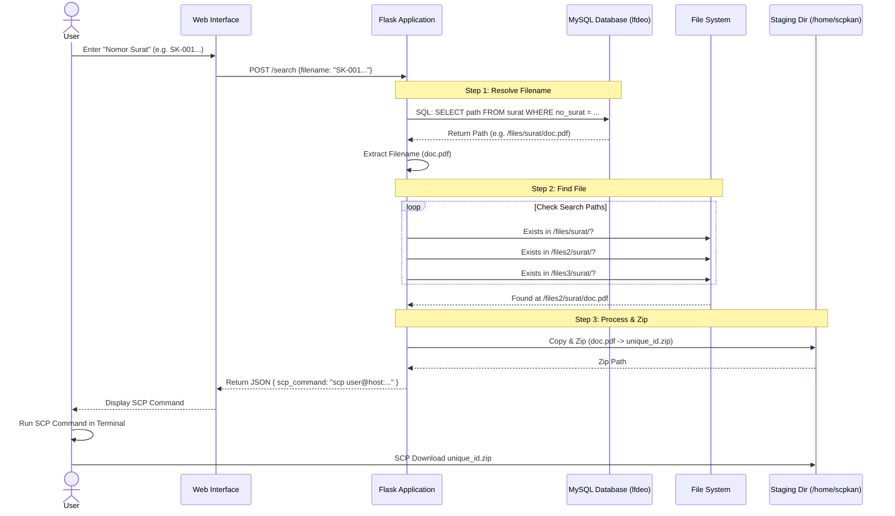

# File Retrieval Process Flow

This diagram illustrates the step-by-step process when a user searches for a document using the "Nomor Surat".

```mermaid
sequenceDiagram
    actor User
    participant WebUI as Web Interface
    participant App as Flask Application
    participant DB as MySQL Database (lfdeo)
    participant FS as File System
    participant Staging as Staging Dir (/home/scpkan)

    User->>WebUI: Enter "Nomor Surat" (e.g. SK-001...)
    WebUI->>App: POST /search {filename: "SK-001..."}
    
    Note over App, DB: Step 1: Resolve Filename
    App->>DB: SQL: SELECT path FROM surat WHERE no_surat = ...
    DB-->>App: Return Path (e.g. /files/surat/doc.pdf)
    App->>App: Extract Filename (doc.pdf)

    Note over App, FS: Step 2: Find File
    loop Check Search Paths
        App->>FS: Exists in /files/surat/?
        App->>FS: Exists in /files2/surat/?
        App->>FS: Exists in /files3/surat/?
    end
    FS-->>App: Found at /files2/surat/doc.pdf

    Note over App, Staging: Step 3: Process & Zip
    App->>Staging: Copy & Zip (doc.pdf -> unique_id.zip)
    Staging-->>App: Zip Path

    App-->>WebUI: Return JSON { scp_command: "scp user@host:..." }
    WebUI-->>User: Display SCP Command
    
    User->>User: Run SCP Command in Terminal
    User->>Staging: SCP Download unique_id.zip
```
